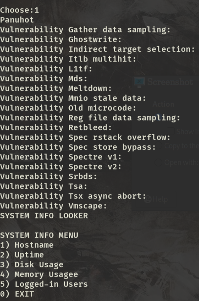

# ShellLooker

ShellLooker is a lightweight Bash utility for system monitoring and security auditing. It helps identify connected processes, detect potential malware or botnet activity, and monitor system updates on Unix-like systems.

## Overview

## Features

- System process monitoring
- Connected network detection
- Potential malware/botnet identification
- System update tracking
- Simple and lightweight Bash implementation
